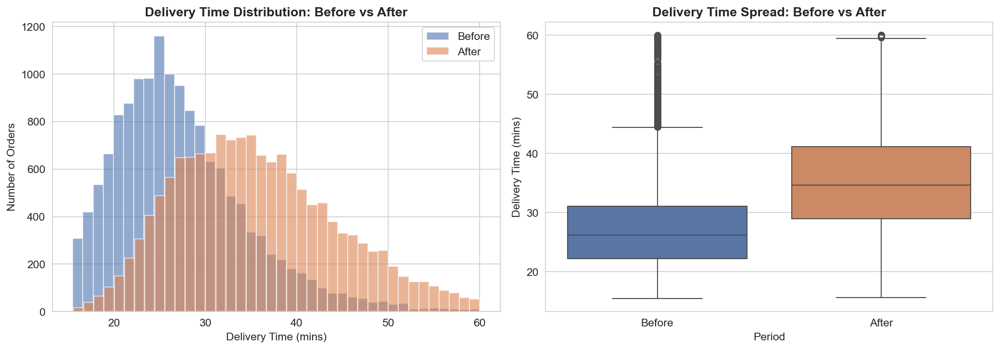
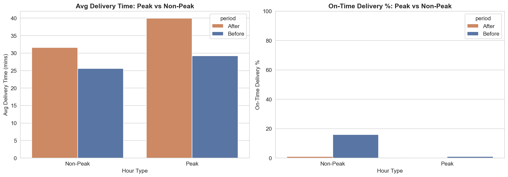
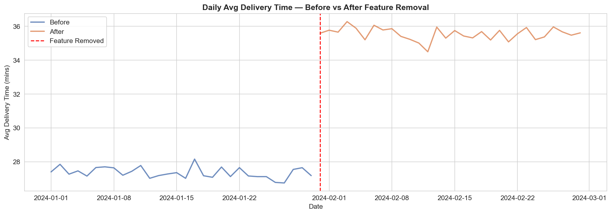

# 📦 Delivery Feature Impact Analysis

## Problem Statement
A hypothetical food delivery platform removed its "Rider Priority Routing" 
feature — an algorithm that matched orders to the nearest available rider. 
This project quantifies the performance impact of that removal using 
data analytics, statistical testing, and business intelligence.

## Key Findings
- Average delivery time increased by **30.0%** (from 27.4 to 35.6 mins)
- On-time delivery % dropped from **9.1%** to **0.4%**
- Cancellation rate rose from **3.76%** to **11.46%**
- Peak hours showed **1.5x more degradation** than non-peak (+37% vs +24%)
- Long-distance + Low-density orders were the worst affected segment (avg 52.7 min, 15.5% cancel rate)
- Estimated revenue impact: **₹59,482 over the 30-day post-removal window**

## Tools & Technologies
| Tool | Purpose |
|------|---------|
| Python (Pandas, NumPy) | Data generation, cleaning, ETL |
| Matplotlib, Seaborn | Exploratory data analysis |
| SciPy, Statsmodels | Statistical hypothesis testing |
| MySQL | Aggregation queries & segmentation |
| Power BI | Interactive dashboard |
| Jupyter Notebook | Analysis environment |
| GitHub | Version control |

## Statistical Methods Used
- Welch's T-Test → delivery time comparison
- Chi-Square Test → on-time %, cancellation rate
- Cohen's d → effect size measurement
- Segmented sub-group analysis → peak/zone/distance

## Project Structure
data/             → Raw and cleaned datasets + SQL output CSVs
notebooks/        → Jupyter notebooks (generation, EDA, stats, SQL)
sql/              → MySQL analysis queries
dashboard/        → Power BI .pbix file
images/           → Exported chart PNGs

## How to Run
1. Clone the repo
2. pip install pandas numpy matplotlib seaborn scipy statsmodels mysql-connector-python
3. Run notebooks in order: 01 → 02 → 03 → 04
4. Open dashboard/delivery_impact.pbix in Power BI Desktop

## Key Visualizations

### Delivery Time Distribution

### Peak vs Non-Peak Impact

### Daily Trend
